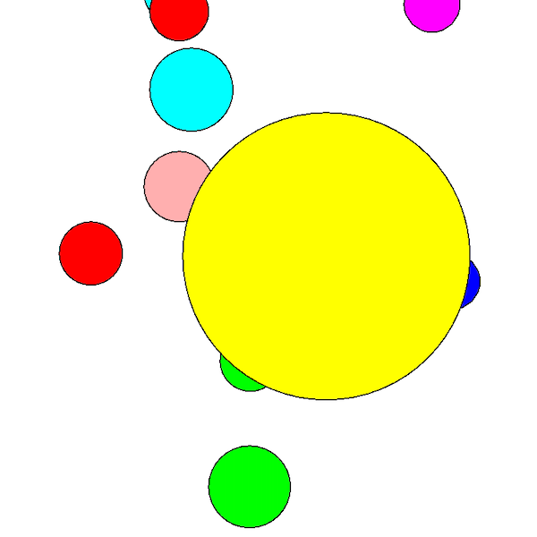
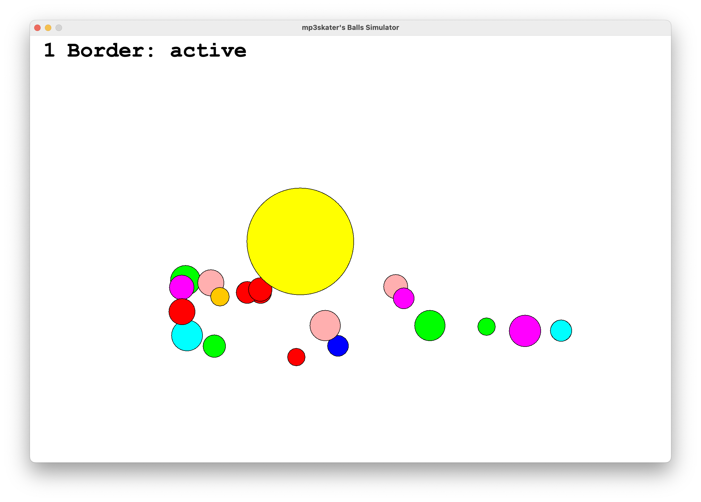
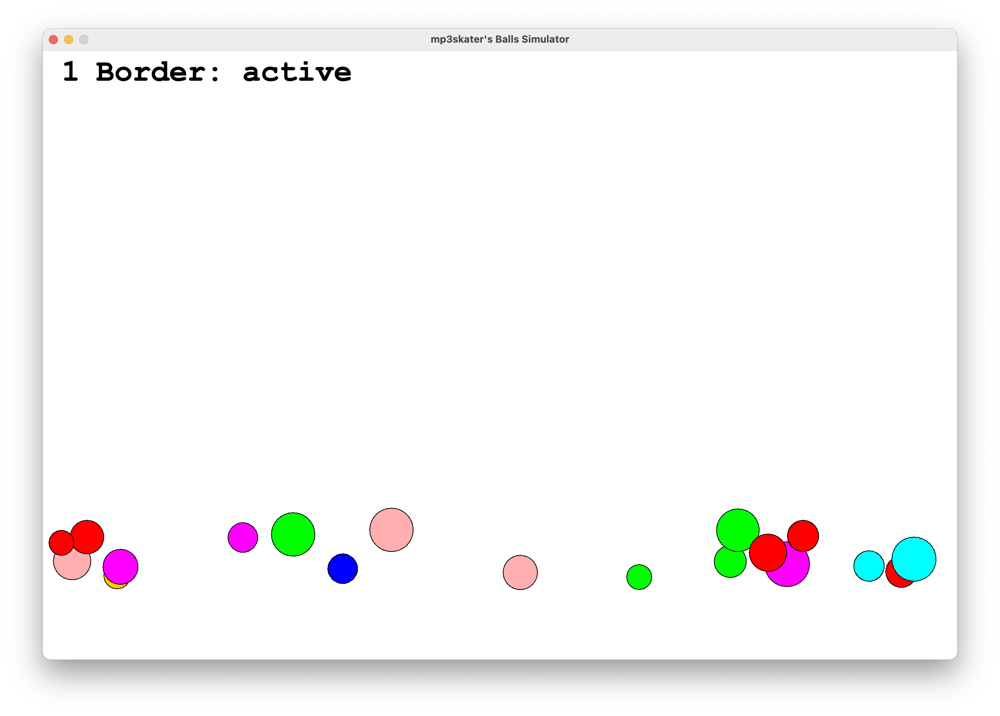

<h1 align="center">
   
  Simulator Balls
</h1>

> A simple game where you can look at and interact with lot's of colorful balls :)

## Features

--> Info: This Game started as a small school project and it's now a (still small) game with lot's of fun features...

**Added Features:**
- Customizable Size
- Lot's of differently sized and colored balls 
- Toggleable border
- Sun-feature (gravitational center controlled with mouse)
- Different gravity directions  (Toggle with SPACE)
- No gravity mode (Toggle with SPACE)
- Stop all movements (Key 0)
- Pause Game with ESC

**In Future:**
- Balls don't bounce infinitly on ground
- Spawn new one's (maybe...)

## Screenshots

Sun-feature                                                                                               |  No-gravity-mode
:--------------------------------------------------------------------------------------------------------:|:-------------------------:
   |   

---

## Installation

To use your own starting board replace the file: "res/board/board.txt", everything other then SPACE will be an alive cell.

### Latest Release

Get the latest builds of GetOP [from the GitHub Releases](https://github.com/mp3skater/GetOP-mod-data/releases).

## License

This project is open source and licensed under the [MIT](/LICENSE) License.
